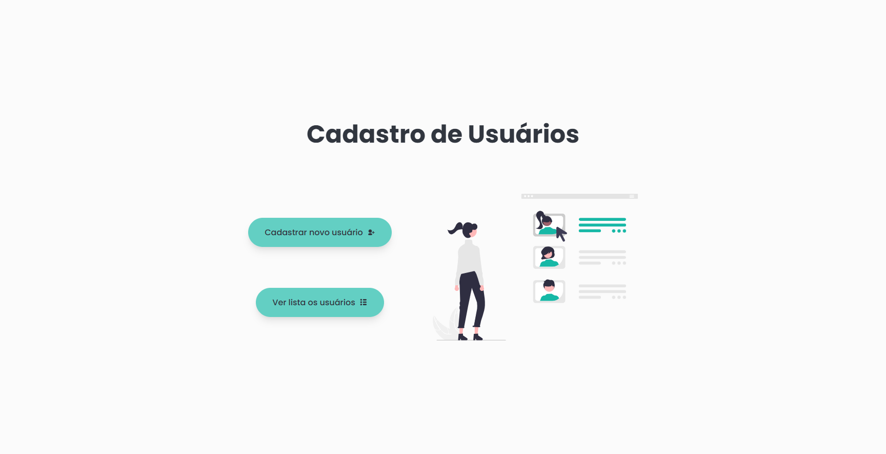
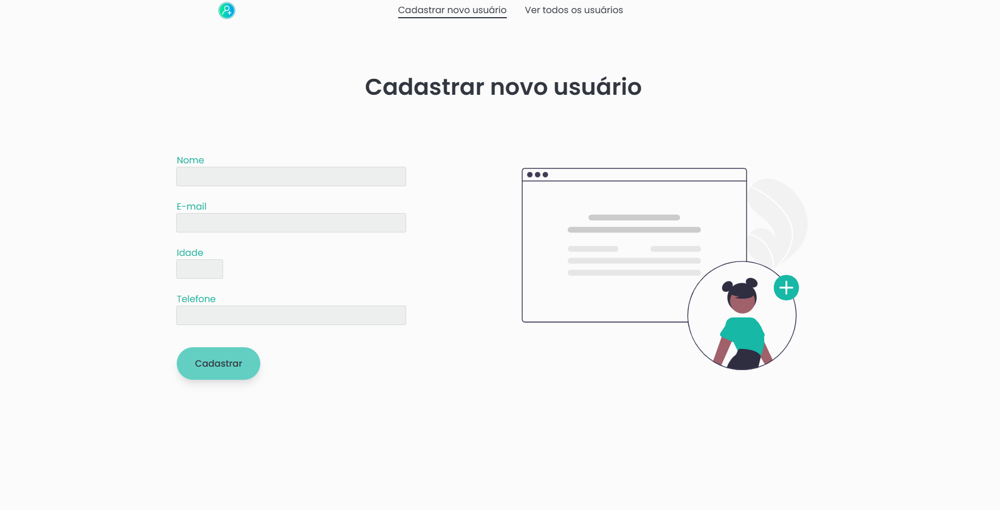
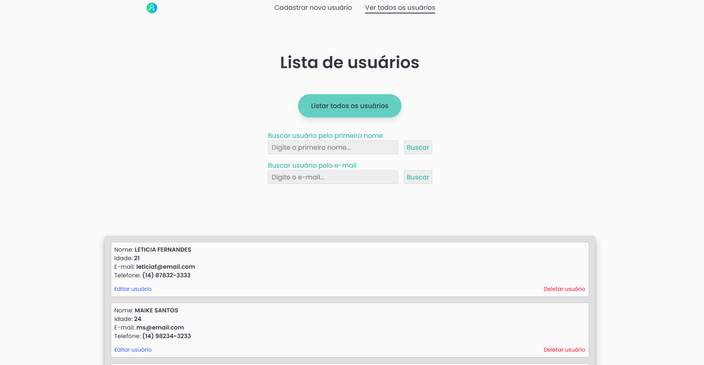
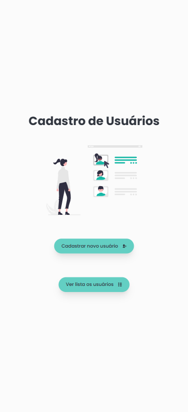
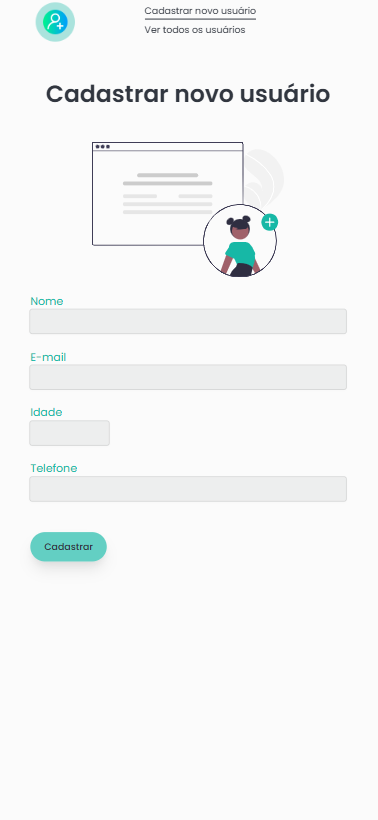
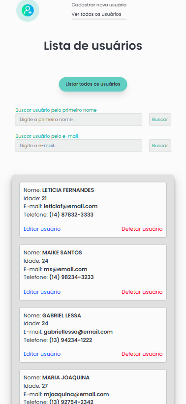

<h1>(Projeto Full Stack) Interface Cadastro de Usuários</h1>

<h5>Interface Cadastro de Usuários, integrada com API Cadastro de Usuários.</h5>

<h4>Tecnologias usadas:</h4>

<h3>Link da API do projeto <a href="https://github.com/lucasfgaldinos/api-cadastro-de-usuarios">aqui</a></h3>

  
  
  
  
  
  

